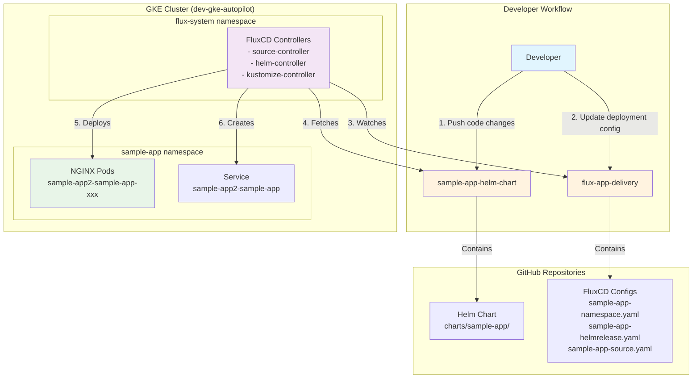
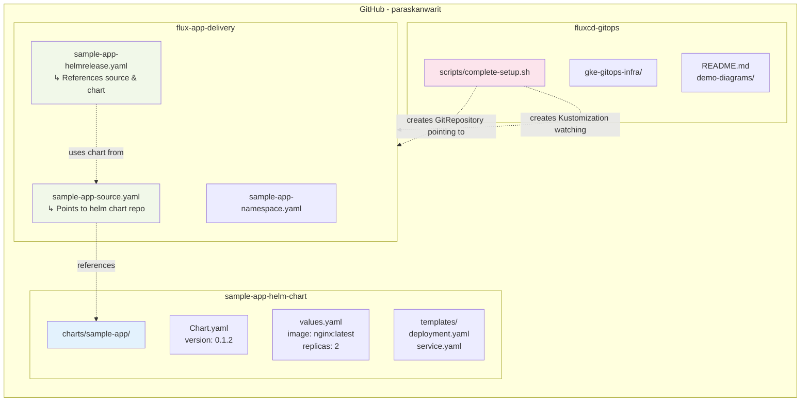
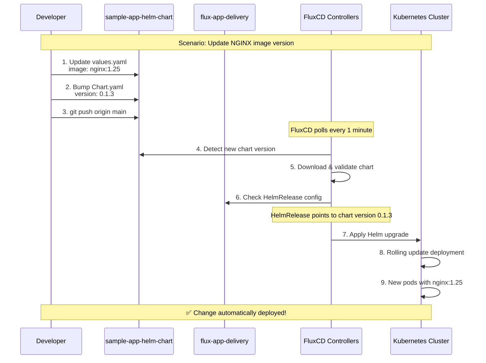
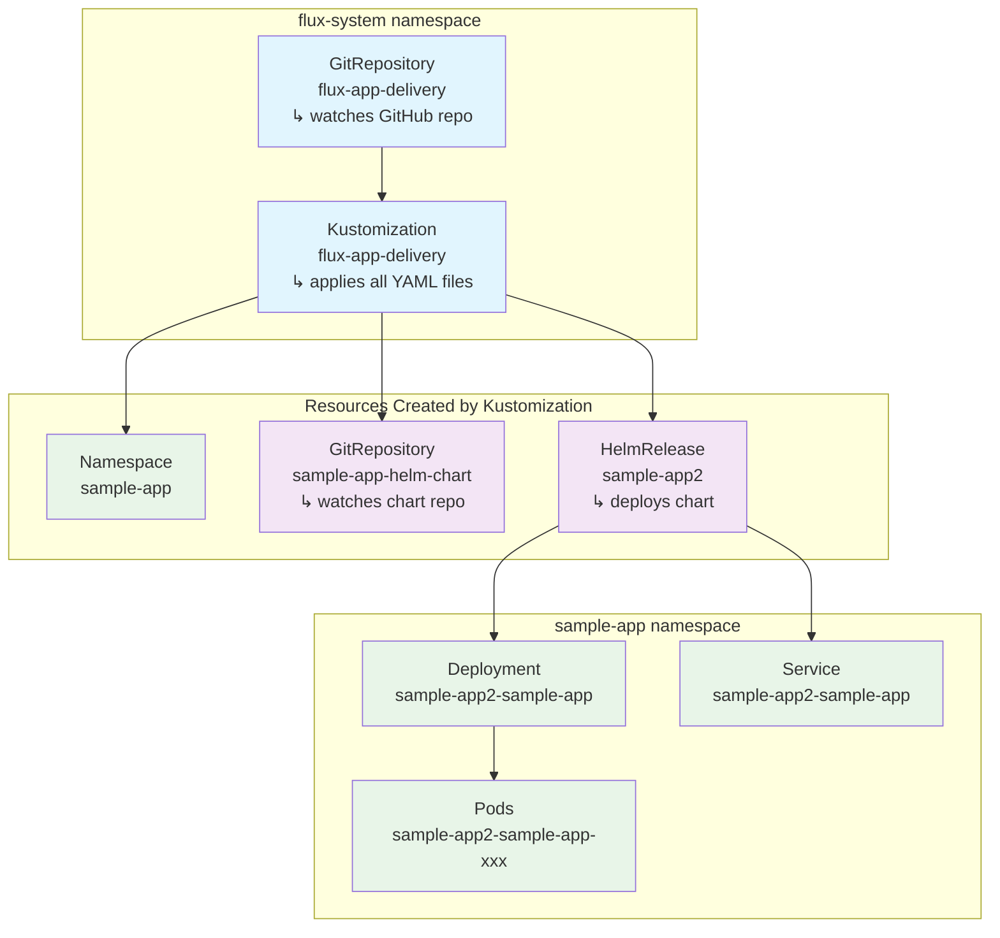

# GitOps Workflow Diagrams

## 1. FluxCD GitOps Architecture Overview



## 2. Repository Interconnection Diagram



## 3. Change Propagation Flow



## 4. File Structure & Relationships

```
GitHub Repositories Structure:
├── sample-app-helm-chart/
│   ├── charts/sample-app/
│   │   ├── Chart.yaml ────────────┐
│   │   ├── values.yaml           │
│   │   └── templates/            │
│   │       ├── deployment.yaml   │
│   │       └── service.yaml      │
│   └── README.md                 │
│                                 │
├── flux-app-delivery/          │
│   ├── sample-app-namespace.yaml │
│   ├── sample-app-source.yaml ───┼─── references chart repo
│   ├── sample-app-helmrelease.yaml ──┘
│   └── README.md
│
└── fluxcd-gitops/
    ├── scripts/
    │   ├── complete-setup.sh ─────── creates GitRepo & Kustomization
    │   └── complete-destroy.sh
    ├── gke-gitops-infra/
    │   └── flux-bootstrap/ ───────── Terraform for FluxCD
    ├── demo-diagrams/ ────────────── This documentation
    └── README.md ─────────────────── Main documentation
```

## 5. FluxCD Resource Relationships in Cluster



## Key Concepts for Team Explanation

### GitOps Principles
1. **Declarative**: Everything defined in Git as YAML
2. **Versioned**: All changes tracked in Git history
3. **Immutable**: Infrastructure as code, no manual changes
4. **Pulled**: FluxCD pulls changes, not pushed

### Repository Separation Strategy
- **sample-app-helm-chart**: Contains the application package (Helm chart)
- **flux-app-delivery**: Contains deployment configuration (where/how to deploy)
- **fluxcd-gitops**: Contains infrastructure setup and documentation

### Automatic Deployment Flow
1. Developer pushes code → GitHub
2. FluxCD detects changes (every 1 minute)
3. FluxCD applies changes → Kubernetes
4. Application automatically updates

### Benefits
- **No kubectl needed**: Everything through Git
- **Audit trail**: All changes in Git history
- **Rollback capability**: Git revert = application rollback
- **Security**: No cluster credentials needed for developers