# GitOps Workflow Diagram

```mermaid
sequenceDiagram
    participant Dev as Developer
    participant AppRepo as sample-app-helm-chart<br/>(GitHub)
    participant GitOpsRepo as flux-app-delivery<br/>(Local/GitHub)
    participant Flux as Flux Controllers<br/>(GKE Cluster)
    participant K8s as Kubernetes<br/>(GKE Cluster)
    participant App as Sample App<br/>(Running Pods)

    Note over Dev,App: Initial Setup & Deployment
    
    Dev->>GitOpsRepo: 1. Configure HelmRelease & GitRepository
    Dev->>Flux: 2. Apply GitOps manifests to cluster
    
    Flux->>GitOpsRepo: 3. Monitor GitOps repo (every 1m)
    Flux->>AppRepo: 4. Monitor Helm chart repo (every 1m)
    
    Flux->>AppRepo: 5. Fetch Helm chart (charts/sample-app v0.1.2)
    Flux->>K8s: 6. Deploy application using Helm chart
    K8s->>App: 7. Create pods with initial configuration
    
    Note over Dev,App: Configuration Change Workflow
    
    Dev->>AppRepo: 8. Update values.yaml<br/>(e.g., image: nginx:1.21 → nginx:1.22<br/>or replicas: 2 → 3)
    Dev->>AppRepo: 9. Commit & push changes
    
    Note over Flux: Flux detects changes (1m interval)
    
    Flux->>AppRepo: 10. Pull latest changes
    Flux->>Flux: 11. Compare current vs desired state
    
    alt Configuration Drift Detected
        Flux->>K8s: 12. Apply Helm upgrade
        K8s->>App: 13. Rolling update pods
        App->>App: 14. New pods with updated config
        
        Note over App: ✅ Application updated automatically
    else No Changes
        Note over Flux: ⏸️ No action needed
    end
    
    Note over Dev,App: Alternative: GitOps Repo Change
    
    Dev->>GitOpsRepo: 15. Update HelmRelease values<br/>(override chart defaults)
    Dev->>GitOpsRepo: 16. Commit & push changes
    
    Flux->>GitOpsRepo: 17. Detect GitOps repo changes
    Flux->>K8s: 18. Apply updated HelmRelease
    K8s->>App: 19. Update application with new values
```



## GitOps Change Scenarios

### 🔄 Scenario 1: Application Code/Image Update
```yaml
# In sample-app-helm-chart/values.yaml
image:
  repository: nginx
  tag: "1.21"  # Changed to "1.22"
  
replicaCount: 2  # Changed to 3
```

### 🎛️ Scenario 2: Environment-Specific Override
```yaml
# In flux-app-delivery/helmrelease/sample-app-helmrelease.yaml
spec:
  values:
    image:
      tag: "1.22"  # Override chart default
    replicaCount: 5  # Override for production
    resources:
      limits:
        memory: "512Mi"  # Environment-specific limits
```

## Flux Reconciliation Process


## Demo Flow Steps

1. **Show Repository Structure** - Explain the three repositories and their roles
2. **Deploy Initial Application** - Run complete-setup.sh script
3. **Verify Flux Installation** - Show Flux controllers running
4. **Show Application Running** - Display pods and services
5. **Make Configuration Change** - Update image tag or replica count
6. **Watch Flux Reconcile** - Show Flux detecting and applying changes
7. **Verify Update Applied** - Show new pods with updated configuration

## Key Demo Points

- **Separation of Concerns**: Infrastructure, Application, and GitOps configs in different repos
- **Automated Reconciliation**: Flux continuously monitors and applies changes
- **Declarative Configuration**: All changes made through Git commits
- **Zero-Downtime Updates**: Rolling updates ensure application availability