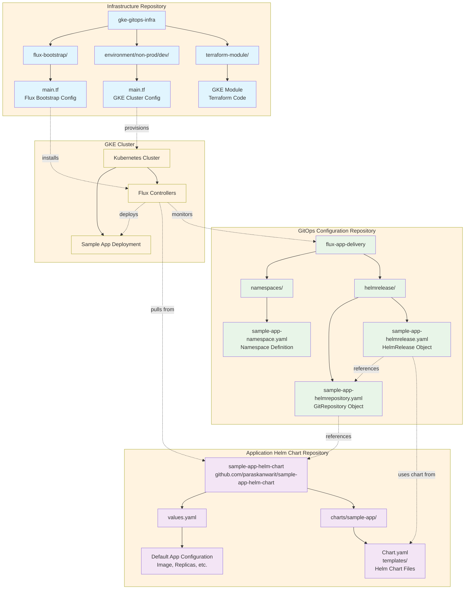

# GitOps Repository Architecture Diagram

## Repository Responsibilities

### 🏗️ Infrastructure Repository (gke-gitops-infra)
- **Purpose**: Infrastructure as Code
- **Contains**: Terraform modules, GKE cluster configuration, Flux bootstrap
- **Owner**: Platform/DevOps Team

### 📦 Application Helm Chart Repository (sample-app-helm-chart)
- **Purpose**: Application packaging and templating
- **Contains**: Helm charts, default values, application templates
- **Owner**: Development Team

### 🔄 GitOps Configuration Repository (flux-app-delivery)
- **Purpose**: Deployment configuration and GitOps manifests
- **Contains**: HelmRelease, GitRepository, Namespace definitions
- **Owner**: DevOps/SRE Team

### ☸️ GKE Cluster
- **Purpose**: Runtime environment
- **Contains**: Flux controllers, deployed applications
- **Managed by**: Flux CD Controllers