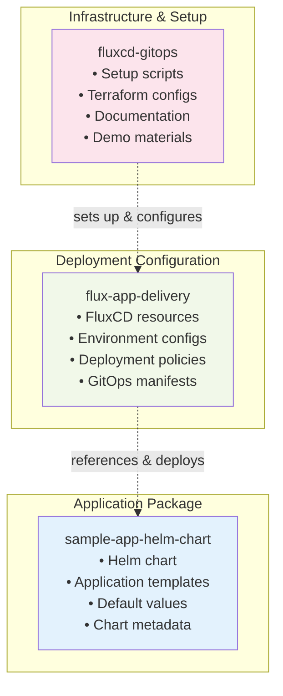

# Repository Architecture & Team Showcase

## Three-Repository GitOps Architecture

This document explains how our three repositories work together to create a complete GitOps workflow.

### Repository Overview



## Detailed File Structure

### 1. fluxcd-gitops (Infrastructure Repository)
```
fluxcd-gitops/
├── README.md                    # Main documentation
├── CLEANUP_SUMMARY.md           # Cleanup report
├── demo-diagrams/               # Team presentation materials
│   ├── gitops-workflow.md          # Workflow diagrams
│   └── repository-architecture.md  # This file
├── scripts/                     # Automation scripts
│   ├── complete-setup.sh           # End-to-end setup
│   ├── complete-destroy.sh         # Cleanup script
│   ├── test-prerequisites.sh       # Environment validation
│   └── test-setup-dry-run.sh       # Dry-run testing
└── gke-gitops-infra/           # Infrastructure as Code
    ├── flux-bootstrap/             # FluxCD installation
    │   ├── main.tf                 # Terraform main config
    │   ├── variables.tf            # Input variables
    │   └── versions.tf             # Provider versions
    └── environment/non-prod/dev/   # GKE cluster configs
        ├── main.tf
        ├── terraform.tfvars
        └── variables.tf
```

### 2. sample-app-helm-chart (Application Repository)
```
sample-app-helm-chart/
├── README.md                    # Chart documentation
└── charts/sample-app/           # Helm chart package
    ├── Chart.yaml                  # Chart metadata
    │   ├── name: sample-app
    │   ├── version: 0.1.2
    │   └── appVersion: "1.0"
    ├── values.yaml                 # Default configuration
    │   ├── image: nginx:latest
    │   ├── replicaCount: 2
    │   └── service: ClusterIP
    └── templates/                  # Kubernetes manifests
        ├── deployment.yaml         # Pod deployment
        ├── service.yaml            # Service definition
        └── _helpers.tpl            # Template helpers
```

### 3. flux-app-delivery (GitOps Configuration Repository)
```
flux-app-delivery/
├──  README.md                           # Deployment docs
├──  sample-app-namespace.yaml           # Namespace creation
├── sample-app-source.yaml              # Git source definition
│   └── → Points to: sample-app-helm-chart
└── sample-app-helmrelease.yaml         # Deployment config
    ├── → References: sample-app-source
    ├── → Chart: charts/sample-app
    └── → Values: custom overrides
```

## How Changes Flow Through the System

### Scenario: Update Application Image


## Team Demonstration Points

### 1. **Separation of Concerns**
- **Infrastructure team**: Manages `fluxcd-gitops`
- **Application team**: Manages `sample-app-helm-chart`
- **Platform team**: Manages `flux-app-delivery`

### 2. **GitOps Benefits**


### 3. **Security & Compliance**
- No direct cluster access needed
- All changes audited in Git
- Declarative configuration
- Automated rollback capability

### 4. **Developer Experience**
```
Traditional Deployment:
Developer → kubectl apply → Manual verification → Hope it works

GitOps Deployment:
Developer → git push → Automatic deployment → Guaranteed consistency
```

## Live Demo Script

### Demo 1: Show Current State
```bash
# Show running application
kubectl get pods -n sample-app
kubectl get svc -n sample-app

# Show GitOps resources
kubectl get gitrepository -A
kubectl get helmrelease -A
```

### Demo 2: Make a Change
```bash
# 1. Edit sample-app-helm-chart/charts/sample-app/values.yaml
# Change: replicaCount: 2 → replicaCount: 3

# 2. Commit and push
git add . && git commit -m "Scale to 3 replicas" && git push

# 3. Watch FluxCD detect and apply changes
watch kubectl get pods -n sample-app
```

### Demo 3: Show GitOps in Action
```bash
# Show FluxCD logs
kubectl logs -n flux-system deployment/helm-controller -f

# Show HelmRelease status
kubectl describe helmrelease sample-app2 -n sample-app
```

## Key Metrics to Highlight

| Metric | Value | Benefit |
|--------|-------|---------|
| Deployment Time | ~2-3 minutes | Automated, no manual steps |
| Rollback Time | ~1 minute | Git revert = instant rollback |
| Configuration Drift | 0% | FluxCD ensures desired state |
| Manual Errors | 0% | Everything through Git |
| Audit Trail | 100% | All changes in Git history |

## Team Learning Outcomes

After this demo, your team will understand:

1. **GitOps Principles**: How Git becomes the source of truth
2. **Repository Strategy**: Why we separate concerns across repos
3. **Automation Benefits**: How FluxCD eliminates manual deployment
4. **Security Model**: How GitOps improves security posture
5. **Operational Excellence**: How to achieve consistent deployments

## Troubleshooting for Demo

### Common Issues & Solutions

| Issue | Command to Check | Solution |
|-------|------------------|----------|
| FluxCD not syncing | `kubectl get gitrepository -A` | Check repository URL and credentials |
| Pods not updating | `kubectl describe helmrelease -n sample-app` | Verify chart version and values |
| Service not accessible | `kubectl get svc -n sample-app` | Check service configuration |

### Demo Recovery Commands
```bash
# Reset to known good state
kubectl delete helmrelease sample-app2 -n sample-app
kubectl apply -f flux-app-delivery/sample-app-helmrelease.yaml

# Force FluxCD sync
flux reconcile source git flux-app-delivery
flux reconcile helmrelease sample-app2 -n sample-app
```