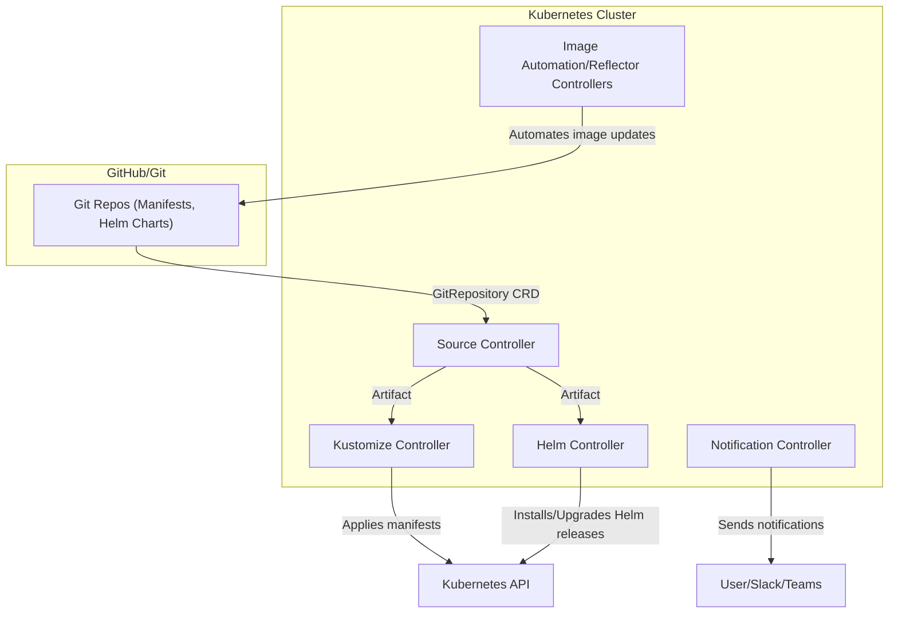

# 📘 FluxCD Deep Dive: The Complete Guide for GKE GitOps

## Table of Contents
1. [What is FluxCD?](#what-is-fluxcd)
2. [Core Concepts](#core-concepts)
3. [FluxCD Architecture](#fluxcd-architecture)
4. [Key Controllers & CRDs](#key-controllers--crds)
5. [GitOps Flow with FluxCD](#gitops-flow-with-fluxcd)
6. [Helm Integration](#helm-integration)
7. [Best Practices](#best-practices)
8. [Troubleshooting & Real-World Tips](#troubleshooting--real-world-tips)
9. [Useful Commands](#useful-commands)
10. [References](#references)

---

## What is FluxCD?

**FluxCD** is a CNCF-graduated, open-source GitOps continuous delivery tool for Kubernetes. It automates the deployment of Kubernetes manifests and Helm charts by continuously reconciling the desired state in Git with the actual state in your cluster.

- **GitOps**: Git is the single source of truth for both infrastructure and application delivery.
- **Declarative**: All desired state is described in YAML/Helm and stored in Git.
- **Automated**: FluxCD watches Git for changes and applies them to the cluster.
- **Auditable**: All changes are tracked in Git history.

---

## Core Concepts

- **Source of Truth**: Git repository containing manifests/Helm charts.
- **Reconciliation**: FluxCD continuously ensures the cluster matches the Git state.
- **Pull Model**: The cluster pulls changes from Git (no external push needed).
- **CRDs**: Custom Resource Definitions (e.g., `GitRepository`, `Kustomization`, `HelmRelease`).
- **Controllers**: Kubernetes controllers that watch CRDs and perform actions.

---

## FluxCD Architecture



---

## Key Controllers & CRDs

### **1. Source Controller**
- **CRDs**: `GitRepository`, `HelmRepository`, `Bucket`
- **Role**: Clones Git repos, fetches Helm charts, produces artifacts for other controllers

### **2. Kustomize Controller**
- **CRDs**: `Kustomization`
- **Role**: Applies Kubernetes manifests from artifacts (supports overlays, patches, etc.)

### **3. Helm Controller**
- **CRDs**: `HelmRelease`, `HelmRepository`
- **Role**: Installs/upgrades Helm charts as releases in the cluster

### **4. Notification Controller**
- **CRDs**: `Alert`, `Provider`, `Receiver`
- **Role**: Sends notifications to Slack, Teams, etc. on events

### **5. Image Automation/Reflector Controllers**
- **CRDs**: `ImageRepository`, `ImagePolicy`, `ImageUpdateAutomation`
- **Role**: Automates image tag updates in manifests (advanced use)

---

## GitOps Flow with FluxCD

1. **Developer pushes change to Git** (manifests or Helm chart)
2. **Source Controller** detects change, fetches new artifact
3. **Kustomize/Helm Controller** applies new manifests or upgrades Helm release
4. **Cluster state is reconciled** to match Git
5. **Notification Controller** can alert on success/failure

### **Example: HelmRelease Flow**
- `HelmRepository` points to a Git or Helm repo
- `HelmRelease` references a chart and version
- On chart or version change, Helm Controller upgrades the release

---

## Helm Integration

- **HelmRepository**: Defines where to fetch charts from (Git, HTTP, OCI)
- **HelmRelease**: Specifies which chart/version/values to deploy
- **Reconcile Strategy**: `ChartVersion` (default) means only chart version bumps trigger upgrades
- **Values**: Can be set inline or from separate files

### **Sample HelmRelease**
```yaml
apiVersion: helm.toolkit.fluxcd.io/v2beta2
kind: HelmRelease
metadata:
  name: sample-app
  namespace: sample-app
spec:
  interval: 5m
  chart:
    spec:
      chart: charts/sample-app
      sourceRef:
        kind: GitRepository
        name: sample-app-helm-chart
        namespace: flux-system
      version: "0.1.2"
  values:
    replicaCount: 2
```

---

## Best Practices

- **Use Separate Repos**: Infra, app, and delivery repos for clear separation
- **Pin Chart Versions**: Always specify chart versions in `HelmRelease`
- **Automate Version Bumps**: Use scripts or bots for chart versioning
- **Monitor Reconciliation**: Use `flux get` commands or the Flux UI
- **Secure Git Access**: Use deploy keys or tokens for private repos
- **Namespace Isolation**: Deploy apps in their own namespaces
- **Backup State**: Regularly backup Git and GCS state
- **Use Alerts**: Set up Notification Controller for visibility

---

## Troubleshooting & Real-World Tips

- **HelmRelease Not Reconciling?**
  - Ensure chart version is bumped
  - Check `flux logs` and `kubectl describe helmrelease ...`
- **Chart Not Found?**
  - Check `chart:` path in `HelmRelease` matches repo structure
  - Ensure `HelmRepository` or `GitRepository` is correct
- **CRD Version Errors?**
  - Use the correct `apiVersion` for your FluxCD version
- **Stuck Resources?**
  - Use `kubectl delete` to force remove, then let FluxCD re-create
- **Debugging**
  - `flux get all -A` for a summary
  - `kubectl get events -A | grep flux`
  - `kubectl logs -n flux-system <controller-pod>`

---

## Useful Commands

- **Install FluxCD CLI**
  ```bash
  brew install fluxcd/tap/flux
  # or
  curl -s https://fluxcd.io/install.sh | sudo bash
  ```
- **Check FluxCD Status**
  ```bash
  flux check
  flux get kustomizations -A
  flux get helmreleases -A
  ```
- **Force Reconcile**
  ```bash
  flux reconcile kustomization <name> -n flux-system
  flux reconcile helmrelease <name> -n <namespace>
  ```
- **View Logs**
  ```bash
  kubectl logs -n flux-system deploy/helm-controller
  ```

---

## References
- [FluxCD Official Docs](https://fluxcd.io/docs/)
- [FluxCD GitOps Toolkit](https://toolkit.fluxcd.io/)
- [Helm Controller Docs](https://fluxcd.io/docs/components/helm/)
- [Kustomize Controller Docs](https://fluxcd.io/docs/components/kustomize/)
- [Source Controller Docs](https://fluxcd.io/docs/components/source/)
- [Notification Controller Docs](https://fluxcd.io/docs/components/notification/)
- [Image Automation Docs](https://fluxcd.io/docs/components/image/)

---

**This guide is designed to help you learn, operate, and troubleshoot FluxCD in real-world GitOps environments.** 