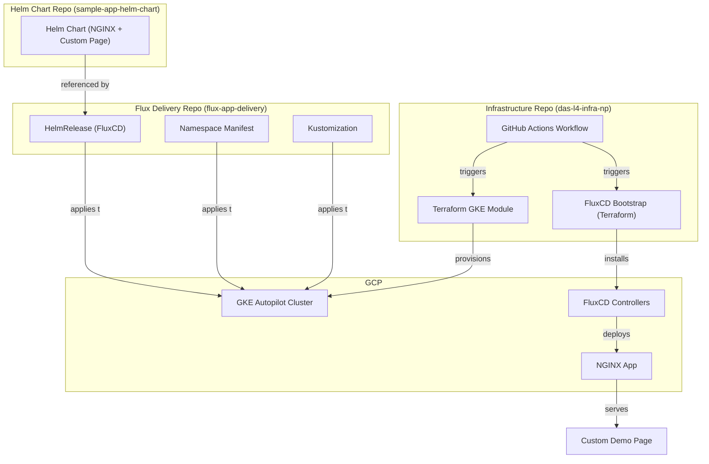
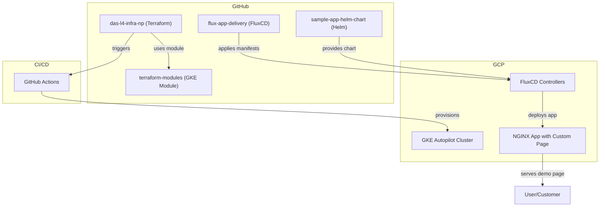

# 🚀 End-to-End GitOps on GKE with Terraform, FluxCD, and Helm

## Table of Contents

1. [Overview](#overview)
2. [Architecture & Flow Diagram](#architecture--flow-diagram)
3. [Repository Structure](#repository-structure)
4. [Step-by-Step Setup Guide](#step-by-step-setup-guide)
5. [GitHub Actions CI/CD](#github-actions-cicd)
6. [Promoting Application Changes (GitOps Flow)](#promoting-application-changes-gitops-flow)
7. [Troubleshooting & Learnings](#troubleshooting--learnings)
8. [Production-Readiness & Best Practices](#production-readiness--best-practices)
9. [Replication Checklist](#replication-checklist)
10. [References](#references)

---

## Overview

This document describes a **production-grade, fully automated GitOps pipeline** using:
- **Terraform** for GKE Autopilot cluster provisioning
- **FluxCD** for GitOps-based application delivery
- **Helm** for application packaging
- **Google Cloud Storage (GCS)** for remote Terraform state
- **GitHub Actions** for CI/CD automation

The setup is modular, supports multi-repo best practices, and is designed for easy demo, learning, and real-world use.

---

## Architecture & Flow Diagram

### **High-Level Flow**



---

## Repository Structure

### 1. **Infrastructure Repo** (`das-l4-infra-np`)
- `environments/non-prod/dev/`
  - `gke.tf` – GKE cluster provisioning (uses remote module)
  - `variables.tf` – All variables for the environment
  - `terraform.tfvars` – Environment-specific values
  - `backend.tf` – GCS backend for state
  - `README.md` – Environment documentation

- `.github/workflows/terraform.yml` – CI/CD workflow for plan/apply/destroy

### 2. **Terraform Modules Repo** (`terraform-modules`)
- `gke-autopilot/` – Reusable GKE Autopilot module

### 3. **Helm Chart Repo** (`sample-app-helm-chart`)
- `charts/sample-app/` – Helm chart for NGINX with custom HTML

### 4. **Flux Delivery Repo** (`flux-app-delivery`)
- `helmrelease/` – FluxCD HelmRelease and HelmRepository
- `namespaces/` – Namespace manifest
- `kustomization.yaml` – Kustomize entrypoint

---

## Step-by-Step Setup Guide

### **Prerequisites**
- GCP Project (e.g., `extreme-gecko-466211-t1`)
- GCS bucket for state (e.g., `terraform-statefile-np`)
- GitHub account and repos created
- `gcloud`, `kubectl`, `terraform`, `helm` CLIs installed
- Workload Identity Federation set up for GitHub Actions

### **1. Clone All Repos**
```bash
git clone https://github.com/paraskanwarit/das-l4-infra-np.git
git clone https://github.com/paraskanwarit/terraform-modules.git
git clone https://github.com/paraskanwarit/sample-app-helm-chart.git
git clone https://github.com/paraskanwarit/flux-app-delivery.git
```

### **2. Configure Terraform Backend**
Edit `environments/non-prod/dev/backend.tf`:
```hcl
terraform {
  backend "gcs" {
    bucket  = "terraform-statefile-np"
    prefix  = "dev/terraform/state"
  }
}
```

### **3. Set Environment Variables**
Edit `terraform.tfvars` for your project, region, etc.

### **4. Initialize and Apply Terraform**
```bash
cd environments/non-prod/dev
terraform init
terraform plan
terraform apply
```
- Provisions GKE Autopilot cluster
- Bootstraps FluxCD (if not already running)

### **5. Push Application and Delivery Repos**
- Push Helm chart to `sample-app-helm-chart`
- Push FluxCD manifests to `flux-app-delivery`

### **6. GitHub Actions Automation**
- On every push, `.github/workflows/terraform.yml` runs:
  - Detects environment changes
  - Applies or destroys infrastructure as needed
  - Handles deletion protection for GKE

---

## GitHub Actions CI/CD

- **Apply Job**: Runs on every push to `main`, applies Terraform changes
- **Destroy Job**: Runs only if an entire environment directory is deleted, disables deletion protection before destroying GKE
- **State Management**: Uses GCS backend, state is always up-to-date and shared

---

## Promoting Application Changes (GitOps Flow)

1. **Update Helm Chart Version**
   - Edit `charts/sample-app/Chart.yaml` and bump `version`
2. **Update HelmRelease Version**
   - Edit `flux-app-delivery/helmrelease/sample-app-helmrelease.yaml` to match chart version
3. **Commit and Push**
   - Push both repos to GitHub
4. **FluxCD Reconciliation**
   - FluxCD detects new version, deploys updated app to GKE
5. **Verify**
   - Access the app via the GKE load balancer and see the updated custom page

---

## Troubleshooting & Learnings

### **Common Issues & Fixes**

- **Terraform Plan Shows Destroy**: Usually due to deletion of key files or state drift. Ensure you only delete environment directories to trigger destroy.
- **Deletion Protection Error**: GKE clusters have deletion protection enabled by default. The workflow now disables it before destroy.
- **FluxCD Not Reconciling**: Ensure chart version and HelmRelease version match. Bump both to trigger reconciliation.
- **State Not Updating**: Check GCS bucket permissions and backend config.
- **GitHub Actions Fails on Variables**: Ensure only required variables are passed for each environment type (GitOps vs CloudSQL).

### **Learnings**
- Always use remote state for team environments
- Modularize Terraform for reusability
- Use GitOps for all application delivery
- Automate everything, including state migration and protection handling
- Document every error and its fix for future reference

---

## Production-Readiness & Best Practices

- **Workload Identity Federation**: Secure GitHub Actions to GCP
- **Deletion Protection**: Enabled by default, but can be disabled for destroy
- **State Encryption**: GCS provides encryption at rest
- **Least Privilege**: Service accounts have only required permissions
- **Multi-Repo Structure**: Follows best practices for separation of concerns

---

## Replication Checklist

- [ ] Create all required GitHub repos
- [ ] Set up GCS bucket for state
- [ ] Configure Workload Identity Federation
- [ ] Clone all repos locally
- [ ] Edit `terraform.tfvars` and `backend.tf` for your environment
- [ ] Run `terraform init` and `terraform apply`
- [ ] Push Helm chart and FluxCD manifests
- [ ] Verify app is deployed and custom page is visible
- [ ] Test GitHub Actions by making changes and observing automation

---

## References

- [Terraform GKE Autopilot Module](https://github.com/paraskanwarit/terraform-modules/tree/main/gke-autopilot)
- [FluxCD Documentation](https://fluxcd.io/docs/)
- [Helm Documentation](https://helm.sh/docs/)
- [GitHub Actions](https://docs.github.com/en/actions)
- [GKE Autopilot](https://cloud.google.com/kubernetes-engine/docs/concepts/autopilot-overview)

---

## 📈 End-to-End Flow Diagram



---

**This document is designed to be your single source of truth for learning, replicating, and demoing this GitOps setup.** 

---

## Optional: Bootstrapping FluxCD via Terraform

This environment supports an **optional pattern** for installing FluxCD automatically after GKE cluster creation using Terraform:

- A file named `flux-bootstrap.tf.example` is provided in this directory.
- **To enable automatic FluxCD installation:**
  1. Copy or rename `flux-bootstrap.tf.example` to `flux-bootstrap.tf`
  2. Run `terraform init` and `terraform apply` again
- **When to use:**
  - Use this for new environments where FluxCD is not yet installed.
  - Do NOT use if FluxCD is already running, to avoid state drift or conflicts.
- This pattern allows easy onboarding for new environments, while following GitOps best practices for existing clusters. 