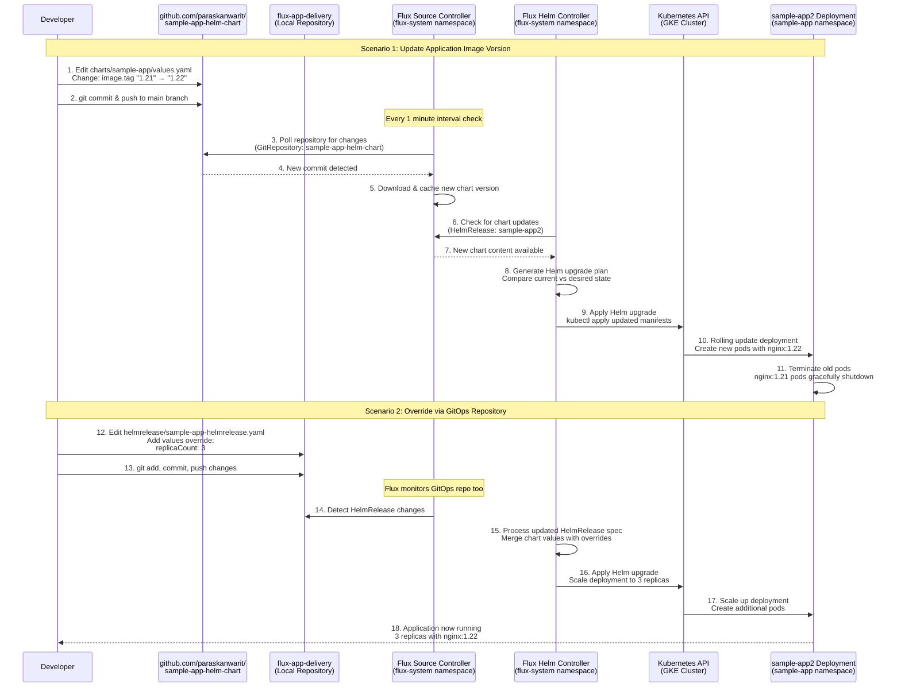

# GitOps Change Workflow - Detailed Process



## Exact File Paths and Objects

**Infrastructure Repository: gke-gitops-infra**
- `terraform-module/` - Reusable GKE Terraform module
- `environment/non-prod/dev/main.tf` - Creates cluster "demo-gke-cluster"
- `flux-bootstrap/main.tf` - Installs Flux with GitHub integration

**Application Repository: github.com/paraskanwarit/sample-app-helm-chart**
- `charts/sample-app/Chart.yaml` - Helm chart metadata (version 0.1.2)
- `charts/sample-app/values.yaml` - Default application configuration
- `charts/sample-app/templates/` - Kubernetes manifest templates

**GitOps Repository: flux-app-delivery**
- `helmrelease/sample-app-helmrepository.yaml` - GitRepository "sample-app-helm-chart"
- `helmrelease/sample-app-helmrelease.yaml` - HelmRelease "sample-app2"
- `namespaces/sample-app-namespace.yaml` - Namespace "sample-app"

**Kubernetes Objects Created:**
- Namespace: `sample-app`
- HelmRelease: `sample-app2` (in sample-app namespace)
- GitRepository: `sample-app-helm-chart` (in flux-system namespace)
- Deployment: Generated by Helm chart (nginx application)
- Service: Generated by Helm chart (exposes nginx)

## Demo Change Examples

**Change Image Tag:**
```yaml
# In sample-app-helm-chart/charts/sample-app/values.yaml
image:
  repository: nginx
  tag: "1.22"  # Changed from "1.21"
```

**Override Replicas:**
```yaml
# In flux-app-delivery/helmrelease/sample-app-helmrelease.yaml
spec:
  values:
    replicaCount: 3  # Override chart default of 1
```