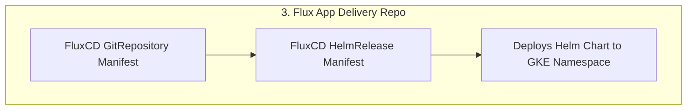

# Flux App Delivery Repo Flow

**Explanation:**
- FluxCD watches the delivery repo for changes.
- The GitRepository manifest points to the Helm chart repo.
- The HelmRelease manifest deploys the app to the GKE cluster. 