# Flux App Delivery Repository Details

```mermaid
graph TD
    subgraph "flux-app-delivery Repository"
        A["📁 helmrelease/sample-app-helmrepository.yaml<br/>GitRepository: sample-app-helm-chart<br/>URL: github.com/paraskanwarit/sample-app-helm-chart<br/>Branch: main<br/>Interval: 1m"]
        
        B["📁 helmrelease/sample-app-helmrelease.yaml<br/>HelmRelease: sample-app2<br/>Namespace: sample-app<br/>Chart: charts/sample-app<br/>Version: 0.1.2<br/>Interval: 5m"]
        
        C["📁 namespaces/sample-app-namespace.yaml<br/>Namespace: sample-app"]
    end
    
    subgraph "External Repository"
        D["🌐 github.com/paraskanwarit/sample-app-helm-chart<br/>📁 charts/sample-app/<br/>Chart.yaml, values.yaml, templates/"]
    end
    
    subgraph "GKE Cluster - flux-system namespace"
        E["🔄 Flux Source Controller<br/>Monitors GitRepository objects"]
        F["🔄 Flux Helm Controller<br/>Processes HelmRelease objects"]
    end
    
    subgraph "GKE Cluster - sample-app namespace"
        G["🚀 Sample App Deployment<br/>Pods, Services, ConfigMaps"]
    end
    
    A --> E
    B --> F
    C --> G
    E --> D
    F --> D
    F --> G
```

This repository contains the GitOps configuration that Flux uses to deploy applications. The GitRepository object points to the external Helm chart repository. The HelmRelease object references the GitRepository and specifies which chart version to deploy. Flux controllers monitor these manifests and automatically deploy the application to the specified namespace.