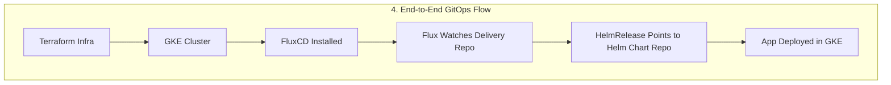

# End-to-End GitOps Flow

**Explanation:**
- Infrastructure is provisioned with Terraform.
- FluxCD is installed and configured to watch the delivery repo.
- HelmRelease manifests in the delivery repo point to the Helm chart repo.
- The app is automatically deployed to GKE via GitOps. 