# Complete End-to-End GitOps Architecture

```mermaid
graph TB
    subgraph "1. Infrastructure Repository: gke-gitops-infra"
        A1["📁 terraform-module/<br/>GKE Terraform Module"]
        A2["📁 environment/non-prod/dev/main.tf<br/>GKE Cluster Configuration<br/>Cluster Name: demo-gke-cluster"]
        A3["📁 flux-bootstrap/main.tf<br/>Flux Installation via Terraform<br/>GitHub Token & Repository Config"]
    end
    
    subgraph "2. Application Chart Repository"
        B1["🌐 github.com/paraskanwarit/sample-app-helm-chart<br/>📁 charts/sample-app/<br/>Chart.yaml (version: 0.1.2)<br/>values.yaml (nginx image, replicas)<br/>📁 templates/ (deployment, service, etc.)"]
    end
    
    subgraph "3. GitOps Repository: flux-app-delivery"
        C1["📁 helmrelease/sample-app-helmrepository.yaml<br/>GitRepository: sample-app-helm-chart<br/>Monitors: github.com/paraskanwarit/sample-app-helm-chart"]
        C2["📁 helmrelease/sample-app-helmrelease.yaml<br/>HelmRelease: sample-app2<br/>References: sample-app-helm-chart<br/>Chart Path: charts/sample-app<br/>Version: 0.1.2"]
        C3["📁 namespaces/sample-app-namespace.yaml<br/>Namespace: sample-app"]
    end
    
    subgraph "4. GKE Cluster: demo-gke-cluster"
        D1["🔄 flux-system namespace<br/>Source Controller<br/>Helm Controller<br/>Kustomize Controller<br/>Notification Controller"]
        D2["🚀 sample-app namespace<br/>sample-app2 HelmRelease<br/>nginx Deployment<br/>Service & ConfigMaps"]
    end
    
    A2 --> D1
    A3 --> D1
    D1 --> C1
    D1 --> C2
    C1 --> B1
    C2 --> B1
    C2 --> D2
    C3 --> D2
```

This shows the complete GitOps flow from infrastructure provisioning to application deployment. Terraform creates the GKE cluster and installs Flux. Flux monitors the flux-app-delivery repository and deploys applications using Helm charts from the external repository. When developers update the Helm chart or GitOps configuration, Flux automatically applies the changes to the cluster. 