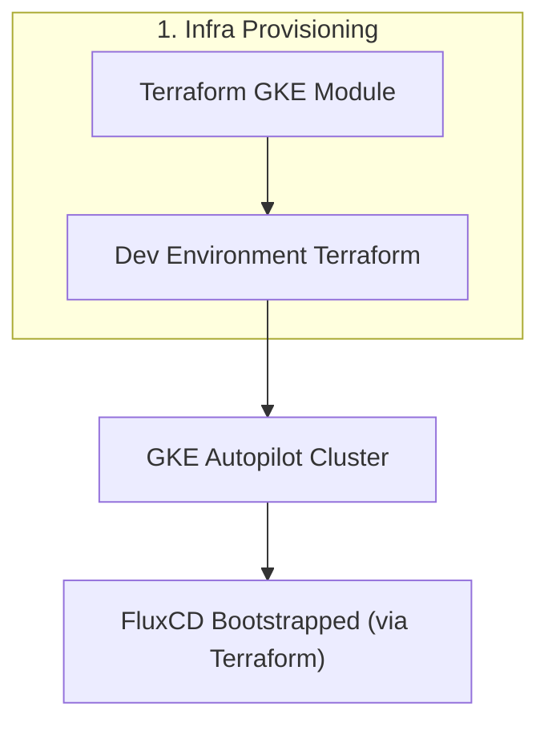

# Infra Provisioning Flow

```mermaid
flowchart TD
    subgraph "1. Infra Provisioning"
        A["Terraform GKE Module"] --> B["Dev Environment Terraform"]
    end
    B --> C["GKE Autopilot Cluster"]
    C --> D["FluxCD Bootstrapped (via Terraform)"]
```

**Explanation:**
- Terraform modules are used to provision a GKE Autopilot cluster.
- FluxCD is installed on the cluster using Terraform. 