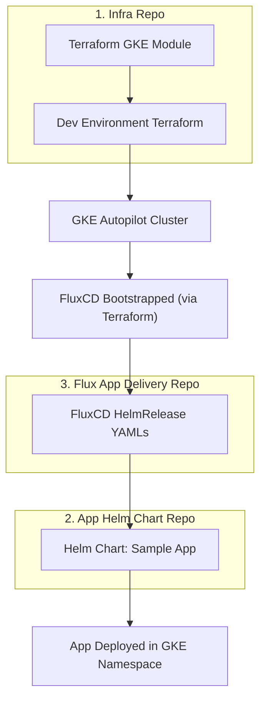

# End-to-End GitOps Flow Diagram

This diagram illustrates the flow from infrastructure provisioning to application deployment using GitOps with GKE, FluxCD, and Helm.

**Explanation:**
- Terraform provisions the GKE cluster and installs FluxCD.
- FluxCD is configured to watch the Flux App Delivery repo.
- The Flux App Delivery repo contains HelmRelease manifests that reference the App Helm Chart repo.
- FluxCD deploys the app into the cluster, in a new namespace. 